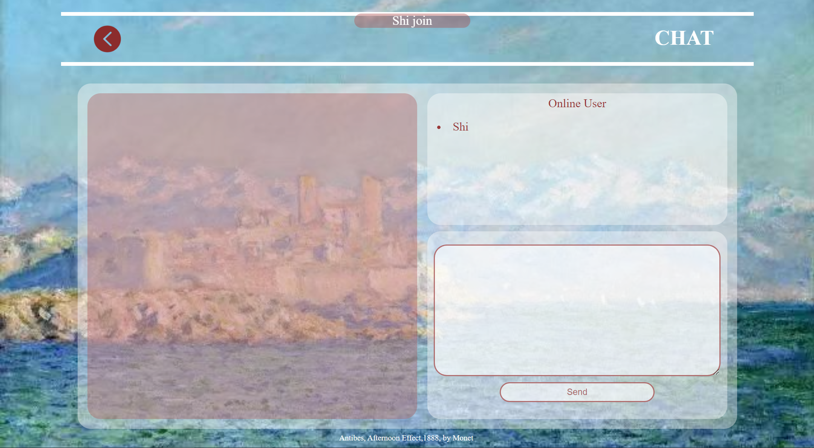

### Explanation for each page
#### 1. Introduction Page
Introduce basic information about this website.

 **On the left hand side**, there is a Intoduction block, including <u>*greeting*, *navigation bar*, *introduction of vavigation bar*</u> and <u>*connection of developer*</u>, including github link, email address and phone number. **On the right**, there is a brief *introduction of the developer*.

 **In the navigation bar**, by hovering over on <u>*"ABOUT"*</u> or <u>*"CHAT!"*</u> you can see the change of background-color and you can go to corresponding page when there is a click.
 

**In the connection area**, by hovering over on <u>github icon</u>, you can see the change of background-color and you can visit the homepage in github of developer when there is a click.
 

**In the introduction of the developer**, there are also links to SCNU and UoA's website where you click <u>*"SCNU"*</u> and <u>*"UoA"*</u>.

#### 2. About Page
Introduce detailed information about developer.

**The headline** includes the <u>*back icon*</u> and the title <u>*"ABOUT ME"*</u>. You can click the <u>*back icon*</u> to go back to the Introduction Page.

**The left column** contains <u>head portrait</u> and <u>basic information</u> about developer, which includes full name, major, location, email address, birthday, MBTI, and hobbies.

**The right colunm** is the <u>detailed self-introduction</u> of the developer. Moreover, the word <u>*"github"*</u> is also a link to developer's github page.

#### 3. Chat Page
In Chat Page, you will firstly be asked to **enter your username** to start chatting.

After you have enter your username, you will see the complete picture of this page, which means you have already **joined the chat**. At the same time, **your username will be posted** on <u>*"Online User"*</u> block, and there is also a **notice on the top of the screen** to tell other users that someone join the chat.

Then you can start chatting. When **you are typing**, there will be a clew of **"(is typing)"** after your username. 

 **Click <u>*"Send"*</u> button** then **your message along with your name will be posted** on chat board, which is on the left.

When other users join, they can only see the online users, but not the chatting messages before they joined.

If you want you leave the chatting room, you can click the <u>*back icon*</u> in headline and go back to the Introduction Page or just close the web page.

when someone leaves the chatting room, his/her username will disappear from the <u>*"Online User"*</u> block. However the messages he/she have sent will be remained. At the same time, there is also **a notice on the top of the screen** to tell users someone is leaving.

### Explanation for Chat Application
#### 1. Online users
First, users will be asked to enter their usernames. After pressing the "Enter" on keyboard, Javascript will determine weather this input is valid through <u>"keyup" event listener</u>. If the input is not null, it will sent to server through <u>socket.emit</u>, and will hide the login block. 

Then, the server will receive username from client side through <u>"socket.on"</u>, and send it to every clients' side through <u>"io.emit"</u>.

Last, the clients side will receive username through <u>"socket.on"</u>, then post it on the website to let everyone see it by creating "\<li\>" , and using <u>innerHTML</u> to add \<a\>  with 'class=username'.

When a user is leaving, server will receive the disconnet instruction, then delete this user from userlist, and update the client side.

#### 2 .Send messages
When user click the submit button, Javascript will detect this action through <u>"submit" event listener</u>. Client side will acquire the message that user want to submit and send it to the server through <u>socket.emit</u>. Then clear the input box. 

when the server receive the message, it will send the meassage along with the username back to all client sides through <u>io.emit</u>.

At last, all client sides will receive receive it, and will post it on the website by creating element \
 and add \<li> inside.

#### 3."is typing" notice
When user click the input box, Javascript will detect this action through <u>"focus" event listener</u> and send this action action to server through <u>socket.emit</u>.

When the server receive the action, it will send the username back to client sides through <u>socket.on</u>

At last, all the client sides will receive the username of whom is typing. Find the corresponding \<a> by class name and add "is Typing" behind through <u>innerTxet</u>.

The notice of stop typing is generally the same as "is typing" notice except that the initial action was detected through <u>"blur" event listener</u>.

#### 4. Notice for user's coming and leaving
When a user joins, after he enter his username, the server will call newUserNotice function to send username to all client sides through <u>io.emit</u>.

Then, client sides will receive it and post it on the website.

The notice of user's leaving is generally the same as the coming notice.
The server receive disconnect instruction, then call userLeaveNotice function to send it to all client sides.

Client sides receive it and post the leaving notice on the screen.

### Challenges during development
